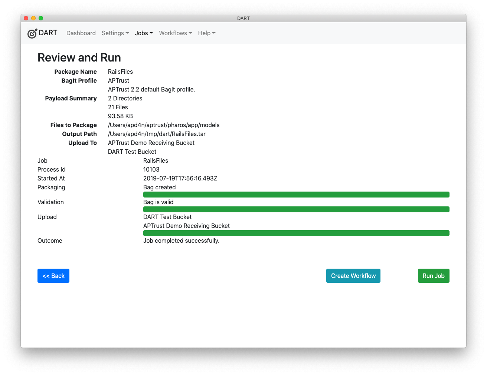

# Bagging Tools

## DART

[DART](https://aptrust.github.io/dart-docs/users/getting_started/) provides both a graphical UI and a command-line interface for building bags and uploading them to APTrust. If you're in a hurry, DART is the best way to get started. If you want to build an APTrust ingest workflow through a point-and-click interface and later incorporate that workflow into a set of scripted tasks, DART is also a good choice, as it supports both graphical and comman-line use.

## Partner Tools

While our suite of command-line tools does not include a bagger, it does include `apt_validate` to help you validate tarred or untarred bags before uploading them for ingest. See our [Partner Tools](tools.md) page for more info.

## Python BagIt

If you want to roll your own bagger, try the Library of Congress's bagit.py module, or create a variation of the work already started by the University of Miami or North Carolina State University.

* [BagIt Python](https://github.com/LibraryOfCongress/bagit-python)
* [Miami's APTrust-specific bagit scripts](https://github.com/UMiamiLibraries/APTrust-Bagit)
* [NCSU's APTrust-specific bagit scripts](https://github.com/NCSU-Libraries/APTrust-Bagit)
