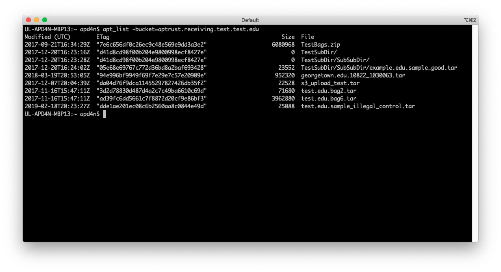

# Partner Tools

!!! warning

    APTrust partner tools have not yet been updated to work with the
    Registry. Current tools still use the outdated Pharos API. We
    expect to update the partner tools in 2023.

Command line tools for Mac, Linux, and Windows are available through the links below:

* [OSX Intel 64-bit, v 2.2-beta](https://s3.amazonaws.com/aptrust.public.download/partner-apps/osx/APTrust_Partner_Tools_Mac_2.2-beta.zip)

* [OSX M1 & M2, v2.2-beta](https://s3.amazonaws.com/aptrust.public.download/partner-apps/osx/PartnerTools-2.2-beta-M1.zip)

* [Linux 64-bit, v 2.2-beta](https://s3.amazonaws.com/aptrust.public.download/partner-apps/linux/APTrust_Partner_Tools_Linux_2.2-beta.zip)

* [Windows 64-bit, v 2.2-beta](https://s3.amazonaws.com/aptrust.public.download/partner-apps/windows/APTrust_Partner_Tools_Windows_2.2-beta.zip)

Each of these tools returns specific exit codes, so you can integrate them into your scripts. You can view any program's built-in documentation by passing the --help flag.

## List of Partner Tools

In addition to our graphical tool for bagging and uploading, [DART](https://aptrust.github.io/dart-docs/users/getting_started/), APTrust also distributes a suite of command-line tools.

These tools use less memory and generally less CPU than DART. They include:

Tool | Description
---- | ----
apt_check_ingest | Queries Pharos to check the ingest status of a bag. This requires a Pharos API key. See the configuration section below.
apt_validate | Validates bags (tarred or untarred) before uploading them for ingest or after downloading them from the restoration bucket.
apt_upload | Uploads bags to your receiving buckets for ingest. Requires AWS keys be present in your config file. See below.
apt_list | Lists the contents of your receiving and restoration buckets. Requires AWS keys.
apt_download | Downloads restored bags from your restoration buckets. Requires AWS keys.
apt_delete | Deletes restored bags from your restoration buckets. Requires AWS keys.

Note that each of these tools has a `--help` option to display available flags,
output formats, and return codes.

## Configuration File

All of the tools except apt_validate require a simple config file with five name-value pairs. Note that quotes are optional, and comment lines begin with a hash mark.

```
# Config for apt_upload and apt_download
AwsAccessKeyId = 123456789XYZ
AwsSecretAccessKey = THIS KEY INCLUDES SPACES AND DOES NOT NEED QUOTES
ReceivingBucket = 'aptrust.receiving.universityname.edu'
RestorationBucket = "aptrust.restore.universityname.edu"
DownloadDir = "/home/josie/downloads"
AptrustApiUser = "archivist@example.edu"
AptrustApiKey = "f887afc5e1624eda92ae1a5aecdf210c"
```

If you prefer not to put your AWS keys in the config file, you can put them into environment variables called `AWS_ACCESS_KEY_ID` and `AWS_SECRET_ACCESS_KEY`.

The config file should include the following variables:

* __ReceivingBucket__: The name of the S3 bucket that will hold your uploaded APTrust bags that are awaiting ingest. E.g. `aptrust.receiving.college.edu`.

* __RestorationBucket__: The name of the S3 bucket that will hold your restored APTrust bags. E.g. `aptrust.restore.college.edu`.

* __DownloadDir__: The local directory in which to save files downloaded from your APTrust restoration bucket. The APTrust config currently does not expand `~` to your home directory, so use an absolute path to be safe.

* __AptrustApiUser__: The email address for logging in to APTrust's Pharos REST API.

* __AptrustApiKey__: Your API key for the Pharos REST API. This key must match the user email. (That is, joe@example.com cannot log in with a key that was issued to beth@example.com.)

If you save your config file as `~/.aptrust_partner.conf` in Linux/Mac or as `%HOMEPATH%\.aptrust_partner.conf` under Windows, you will not have to specify a --config option when you run the tools. Otherwise, run the tools with the --config file pointing to the full path of your configuration file.


Below is a screenshot of apt_list showing the contents of an AWS receiving bucket.



apt_check_ingest shows the ingest status of items that match a specified file name.


