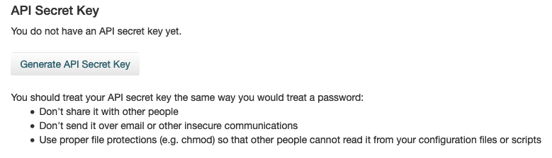

# Pharos REST API

The Pharos REST API enables you to programmatically query information about intellectual objects, files, premis events, and work items.

For safety purposes, the API is primarily read-only. It does not allow object or file deletion, though it does allow you to request object restoration.

The most common uses of the API are:

* Querying for an inventory of intellectual objects
* Querying for an inventory of files
* Checking the status of pending work items, such as ingests and restorations

## Getting an API Key

To use the API, you'll need to get an API token from Pharos. Follow these steps:

1. Log in to Pharos.

1. Click your name in the upper right corner, then select __View Profile__.

1. On the profile page, click the __Generate API Secret Key__ button.



!!! note "Separate Keys for Demo and Production Repositories"
    The key you generate on https://demo.aptrust.org will only work on the demo server. The key you generate on https://repo.aptrust.org will only work on the production server.

## Using Your Key to Connect to the REST API

To connect to the REST API, send your Pharos login email address and your API key in the following request headers:

```
X-Pharos-API-User: user@example.com
X-Pharos-API-KEY: topsecretapikey
```

## REST API Documentation

For full interactive documentation of our REST API, see our [Swagger Documentation](https://aptrust.github.io/pharos/){target=_blank}.

## Partner Tools That Use the REST API

If you don't have the means to develop your own API client, you can use the apt_check_ingest program in the [APTrust Partner Tools](../partner_tools.md) to check the status of ingested and pending items. This command-line
tool returns JSON data that can be parsed by Ruby, Python, PHP and other
scripting languages.
