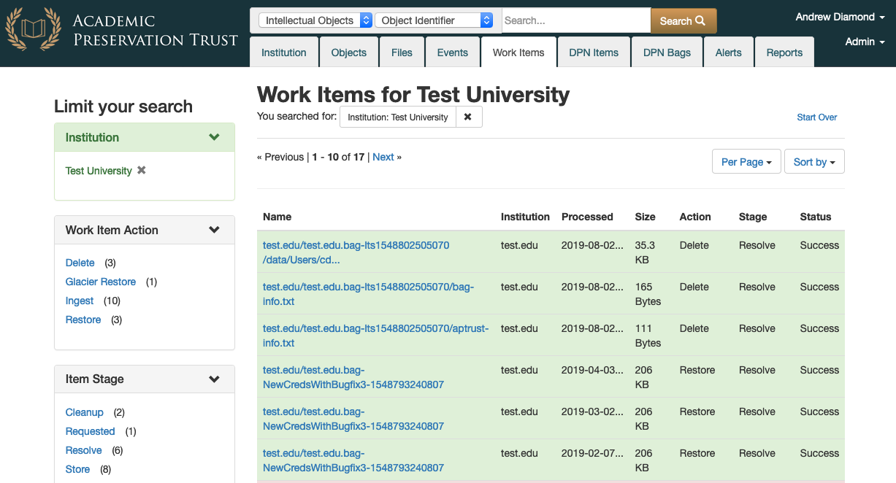

# Work Items

Work items are tasks that APTrust systems perform in response to depositor requests. The Work Items list shows the status of your institution's recent requests. You can view the list by clicking the Work Items tab in Pharos.

You can filter the list to specific actions, statuses, and stages by clicking any of the action/status/stage names in the left column.

## Actions

Work Item actions include the following:

* __Ingest__ - Getting new or updated objects into the system.

* __Restore__ - Restoring individual files or whole intellectual objects to a depositor's restoration bucket.

* __Glacier Restore__ - This is the first step in restoring objects and files from Glacier.

* __Delete__ - Deleting files or objects from preservation storage.

## Stages

* __Cleanup__ - The task has completed and the system has cleaned up temporary files. This applies only to ingest and restoration actions. This stage is more meaningful to APTrust internal operations than to depositors.

* __Fetch__ - The system is retrieving a bag from the receiving bucket for ingest, or is retrieving files from preservation storage for restortation.

* __Package__ - An intellectual object's files are being repackaged into a new bag for restoration.

* __Receive__ - APTrust has noticed a new bag in a receiving bucket, but has not yet begun to process it for ingest.

* __Record__ - The system has finished copying a bag's files to preservation storage and is now recording metadata in Pharos.

* __Requested__ - A depositor has requested a restoration or deletion, but the system has not yet begun to process it.

* __Resolve__ - A task has completed. See Statuses below for the outcome.

* __Store__ - Files are being copied to long-term preservation. This applies only to ingest.

* __Unpack__ - Obsolete.

* __Validate__ - The system is validating a bag before ingest, or it's validating a bag it has just assembled for restoration.

## Statuses

* __Cancelled__ - The task was cancelled by an APTrust administrator. You find an explanation of the cancellation by clicking on the item and reading the Note/Error field.

* __Failed__ - The task failed. Virtually all failures result from one of the following causes:

    * A depositor submitted an invalid bag for ingest. This is a permanent error and the system will not retry the task until the depositor submits a new version of the bag.

    * The system has run into a temporary problem such as lack of disk space or poor network connection. The system will automatically retry the task. If the task fails repeatedly, an APTrust admin will try to solve the underlying problem and then tell the system to retry the task again.

* __Pending__ - The system is waiting for available resources to start the next stage of the task. See Stages above.

* __Started__ - The system has started the current Stage of the task and is still working on it. The Fetch, Validate, Store, Record, and Package stages can take several hours for very large bags.

* __Success__ - The task completed successfully.
