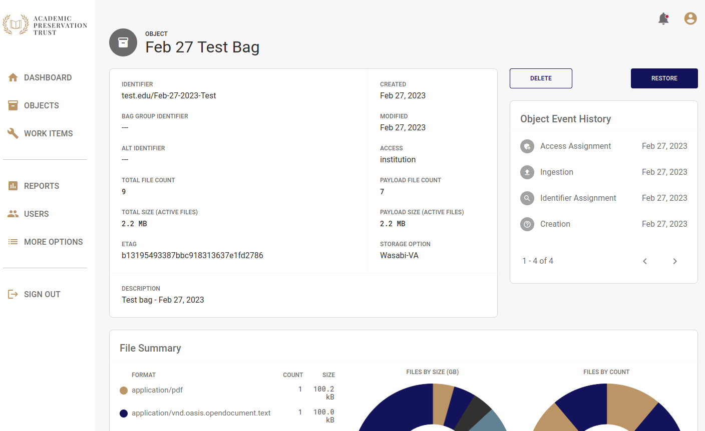
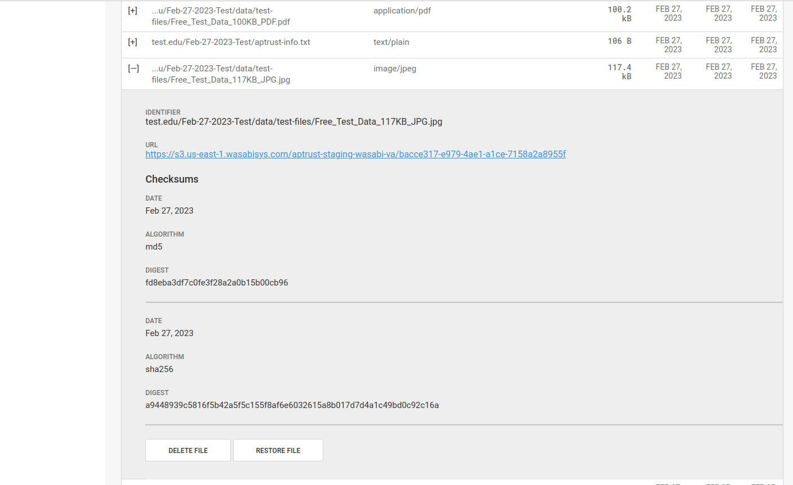
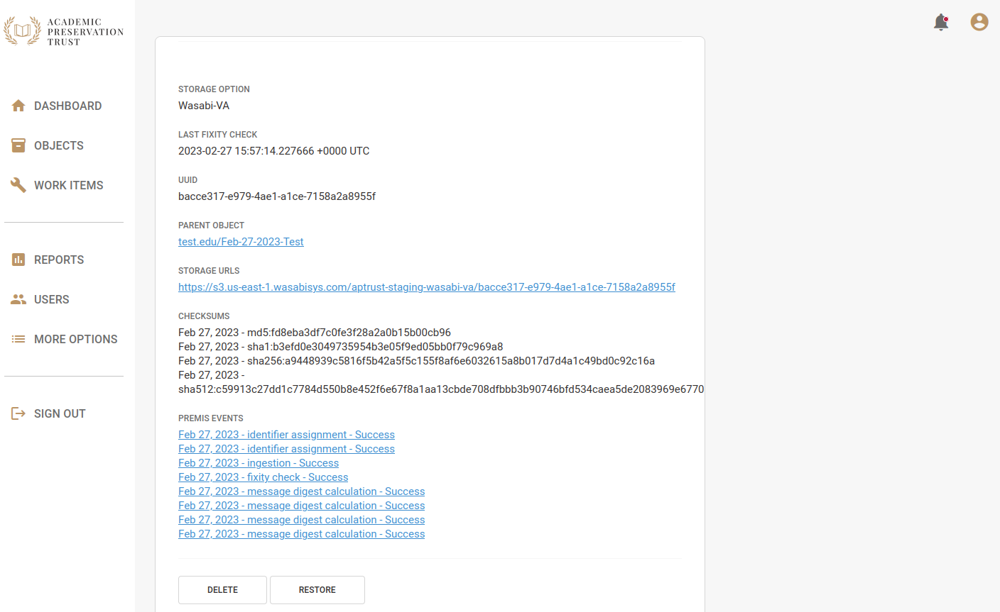
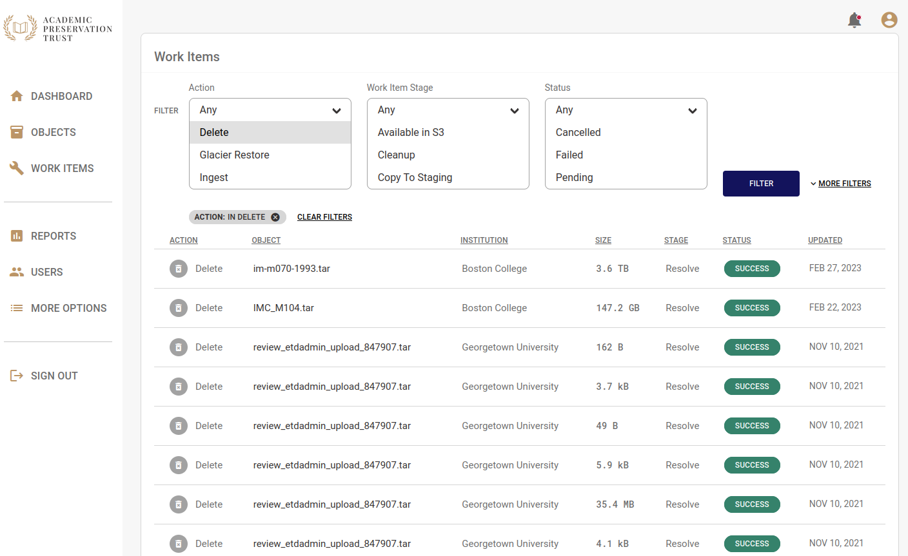

# Deletion

## The Deletion Process

Deleting objects from APTrust is a multi-step process.

1. An institutional administrator requests deletion of a file or entire object by clicking the delete button in Registry (see below). Note that only institutional administrators can request deletions.

2. APTrust generates an email to other administrators at the same institution asking them to confirm the deletion.  (If your institution has only one admin, APTrust will send the confirmation email to that admin.)

3. If one additional admin clicks the 'confirm deletion' link in the email, the files or objects will be deleted.

## Deleting an Intellectual Object

The screenshot below shows the detail page for an intellectual object. Clicking the __Delete__ button on this page initiates the deletion process for the entire object.

## Deleting a Single File

You can delete individual files from the Intellectual Object page or from the Generic File Detail page. To restore from the Intellectual Object page:

1. Locate the file you want to restore. If you don't see it in the list of files below the donut charts, you can search for it by identifier or you can click one of the arrows below the list to load another page of file results.
1. Click the plus sign next to the file you want to restore. This opens the file detail view.
1. Scroll down to the end of the shaded file detail view and click the __Delete File__ button.

You can also delete files from the file detail page. To do so:

1. Click __More Options__ in the left nav.
1. Click __Files__.
1. Enter the file identifier in the search box and click __Filter__.
1. Click on the file you want to restore. This will open the file detail view.
1. Scroll to the bottom of the page and click __Delete__.

## Deletion Requests

After clicking the __Delete__ button, the system will create a deletion request record and send emails to other administrators at your insitution asking them to approve or reject the deletion request. The deletion emails contain a link and a special token to access the deletion request.

The administrator follows the link, enters the token, then chooses whether to approve or reject the request. Note that even if an unauthorized user gets hold of the token in the email, they won't be able to approve or reject the request unless they are an admin at your institution.

If the admin rejects the deletion request, the process ends there, and Registry takes no further action.

If the admin approves the request, the Registry creates a Deletion Work Item and hands it off to Preservation Services to fulfill.

## Deletion Work Items

After an institutional administrator confirms a deletion, the deletion request will appear in the list of work items, where you can track its progress. Deleting a single file or a single object results in one work item.

The image below shows a list of completed work items. Note that deletions usually happen fairly quickly, within minutes of your institutional admin's confirmation of the deletion request email.

## Deletion Request Records

You can view a list of all requested deletions* from your institution by clicking __More Options__ in the left nav bar, then clicking __Deletions__. Click on any item in the list to see when the deletion was requested, and by whom. You'll also see who approved or rejected it, the file or object to be deleted, and (if the deletion was approved) the associated Work Item.

## Effect of Deletion on Metadata

When you delete a file, Registry creates a deletion PREMIS event for the file that includes the date and time of deletion and the email address of the user who requested the deletion. Registry keeps the generic file records, changing it's state from 'Active' to 'Deleted.' Registry also keeps all prior PREMIS events and fixity records related to the file, and the file record remains accessible through both the Web UI and the member API. In addition, Registry keeps a Work Item record that shows when the deletion was requested and when it was completed. Work Items are also available through the Web UI and the member API.

## Bulk Deletion

Contact help@aptrust.org if you want to delete a large number of objects. For bulk deletions, the depositor sends us a list of items to delete and APTrust initiates the process.

Your institutional admins will still have to confirm the deletions before we execute them, but the process can save you having to click on the delete button on a large number of object or file detail pages.
