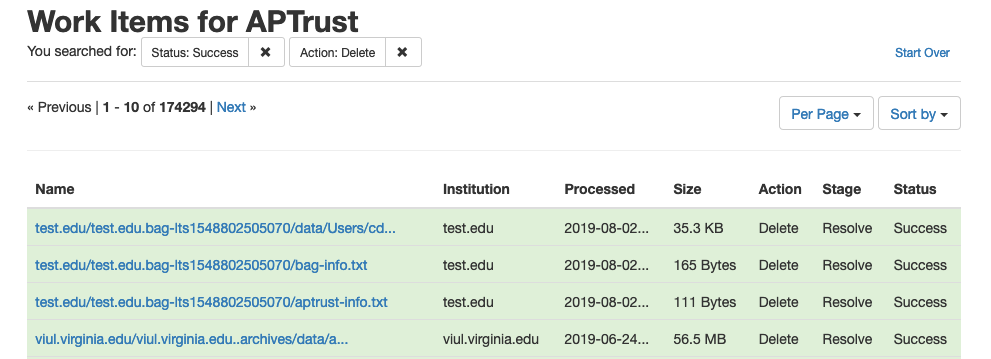

# Deletion

## The Deletion Process

Deleting objects from APTrust is a multi-step process.
blockdiag {
	Admin makes deletion request -> APTrust sends email to admins for confirmation
-> Admin confirms -> System queues deletion
}

1. An institutional administrator requests deletion of a file or entire object by clicking the delete button in Pharos (see below). Note that only institutional administrators can request deletions.

2. APTrust generates an email to other administrators at the same institution asking them to confirm the deletion.  (If your institution has only one admin, APTrust will send the confirmation email to that admin.)

3. If one additional admin clicks the 'confirm deletion' link in the email, the files or objects will be deleted.

## Deleting an Intellectual Object

The screenshot below shows the detail page for an intellectual object. Clicking the red __Delete__ button on this page initiates the deletion process for the entire object.

## Deleting a Single File

To delete a single file, go to the detail page of the file and click the red __Delete__ button. You can find the file in one of two ways:

* Search for the file using the file identifier.

    

* Search for the object using the object identifier.

    

If you searched by object identifier, you can click the __View Preserved Files__ button on the object detail page to find the detail page of the file you want to delete.

The screenshot below shows the detail page for a generic file. Clicking the red __Delete__ button on this page initiates the deletion process for that file.

## Deletion Work Items

After an institutional administrator confirms a deletion, the deletion request will appear in the list of work items, where you can track its progress. Deleting a single file results in one work item. Deleting an intellectual object results in one Work Item _per file_. Deleting an intellectual object comprised of 20 files will create 20 work items.

The image below shows a list of completed work items. Note that deletions usually happen fairly quickly, within minutes of your institutional admin's confirmation of the deletion request email.

## Effect of Deletion on Metadata

When you delete a file, Pharos creates a deletion PREMIS event for the file that includes the date and time of deletion and the email address of the user who requested the deletion. Pharos keeps the generic file records, changing it's state from 'Active' to 'Deleted.' Pharos also keeps all prior PREMIS events and fixity records related to the file, and the file record remains accessible through both the Web UI and the member API. In addition, Pharos keeps a Work Item record that shows when the deletion was requested and when it was completed. Work Items are also available through the Web UI and the member API.

## Bulk Deletion

Contact help@aptrust.org if you want to delete a large number of objects. For bulk deletions, the depositor sends us a list of items to delete and APTrust initiates the process.

Your institutional admins will still have to confirm the deletions before we execute them, but the process can save you having to click on the delete button on a large number of object or file detail pages.
