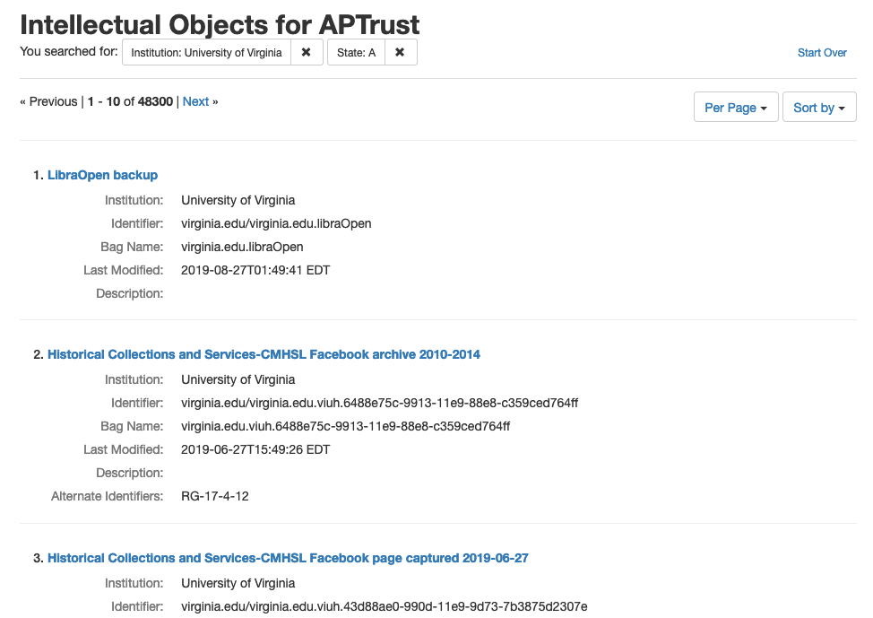
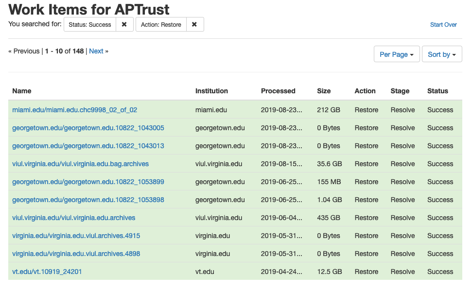

# Restoration

## Restoring Intellectual Objects

You can restore an intellectual object by navigating to the object detail page and clicking the __Restore Object__ button. To reach the object detail page, you can either click on the name of the object in the object list:

Or search by object identifier:

After you click __Restore Object__, APTrust does the following:

1. Creates a work item describing what is to be restored.

1. Copies all of the object's files into a new bag, verifying each file's checksums in the process.

1. Copies the latest version of the aptrust-info.txt and bag-info.txt files into the bag.

1. Writes a JSON file into the bag containing all of the PREMIS events APTrust recorded for that bag and its contents.

1. Adds md5 and sha256 manifests and tag manifests to the bag.

1. Copies the bag to your restoration bucket at `aptrust.restore.<your.domain>` in our production repo, or `aptrust.restore.test.<your.domain>` in our demo repo.

1. Marks the work item as complete.

### Notes on Restored Bags

Because we rebuild bags for restoration, the bag you get back will not exactly match the bag you deposited, though we do guarantee that it contains all of the latest versions of all of the payload files.

Restored bags tend to differ in the following ways from your originally submitted bags:

* Restored bags have both sha256 and md5 manifests, while the bag you originally deposited typically has only one or the other.

* Restored bags include md5 and sha256 tag manifests while bags submitted for ingest typically have neither.

* Restored bags include a `PremisEvents.json` file describing all PREMIS events related to the bag and its contents since it was ingested.

* Restored bags include the __latest__ version of each preserved file in the payload (data) directory.

These last two points are important. In some cases, you or someone at your institution may have deleted files from a bag, or uploaded newer versions of files in a bag after the bag was initially ingested. The PremisEvents.json file includes a list of all deletions and re-ingests. In cases where files have been deleted or updated, these event records can help you understand why the restored payload does not match the payload of the originally submitted bag.

## Restoring Individual Files

To restore an individual file, navigate to the file's detail page in Pharos and click the __Restore File__ button. You can find the file detail page in one of two ways:

* Search for the file using the file identifier.

    

* Search for the object using the object identifier.

    

If you searched by object identifier, you can click the __View Preserved Files__ button on the object detail page to find the detail page of the file you want to restore. The __Restore File__ button appears at the bottom of the page.

APTrust performs the following steps for file restoration:

1. Creates a work item with the restoration request.

1. Verifies the file's checksum.

1. Copies the file to your receiving bucket at `aptrust.restore.<your.domain>` in our production repo, or `aptrust.restore.test.<your.domain>` in our demo repo.

1. Marks the work item as complete.

## Restoration Timeline

Restoring an item usually takes anywhere from 10 minutes to 24 hours, depending on the size of the object, where it is stored, and the number of work items the system has to process before it gets to yours.

* When restoring items from S3, the restoration process can usually begin immediately, since the files are immediately accessible. For items using Standard storage (as opposed to Glacier-Only), APTrust always restores from S3.

* Restoring from Glacier takes longer than restoring from S3.
    * When restoring from Glacier-only storage, it takes 4-5 hours to move files to a place where APTrust can copy and validate them.
    * When restoring from Glacier Deep Archive, it takes 12 hours to move files into a location where APTrust can copy and validate them.

* The size of the items being restored determines how long it will take to restore them. For example, a 1 MB file can often be restored in under a minute. A 1 TB bag may take 24 hours or more. Most of restoration time is taken up by copying the files and validating their md5 and sha256 checksums.

* You can calculate overall restoration time as:
    * S3: A product of file size: A few minutes for a few megabytes, or several hours for objects and files over 100 GB.
    * Glacier: 4-5 hours plus file size.
    * Glacier Deep Archive: 12 hours plus file size.

## Monitoring Restoration Progress

You can check the progress of your restoration requests in Pharos' Work Items list or the [Pharos REST API](https://aptrust.github.io/pharos/){target=_blank}.

When a restoration is complete, the file or bag will be waiting in your restoration bucket and APTrust will send an email to your institutional admins. The email includes information about the location of the restored file so you can download it.

!!! Tip "Downloading Restored Items"
    You can use the apt_download command from our [Partner Tools](../partner_tools.md) to download restored bags.

Restored items are automatically deleted from your restoration bucket after 14 days to avoid ongoing storage costs. (We do not delete the preservation copy, only the copy in your restoration bucket.)
