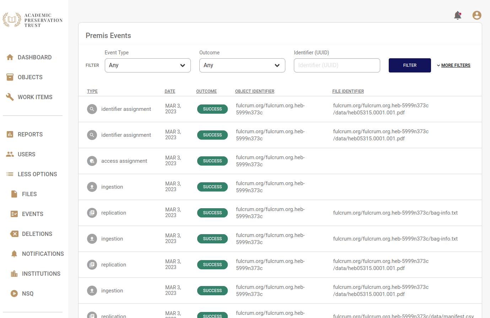

# Premis Events

APTrust records PREMIS events for intellectual objects and generic files. You can view a list of all events related to your instution's objects and files by clicking the __Events__ link under  __More Options__ tab in the left nav.

Use the filters at the top of the page to filter by event type, date, outcome, file identifier and object identifier.

!!! note

    Note that although the sidebar lists all of the event types defined by the Library of Congress's PREMIS specification, APTrust only implements the event types listed below.

## Object-Level Events

The APTrust repository records the following PREMIS events for intellectual objects:

* __Ingestion__ - The ingest process for the object completed. This means the object record was created and all of the object's files were copied to preservation storage.

* __Creation__ - The object record was created.

* __Access Assignment__ - The object was assigned an access setting of _Consortia_, _Institution_, or _Restricted_. See [access values](../depositing/index.md#allowed-access-values) for definitions.

* __Identifier Assignment__ - The object was assigned an identifier. APTrust object identifiers use the pattern `<institution.domain>/<object_name>`, where object_name is the institutional identifier concatenated with name of the tarred bag (minus the .tar extension). For example, `test.edu/bag_of_photos`.

* __Deletion__ - The object was deleted. This means that all of its component files were deleted. Registry keeps a record of the object and all of its files after deletion, though it does not retain the files themselves.

## File-Level Events

APTrust records the following PREMIS events for the generic files that make up each intellectual object:

* __Ingestion__ - The file has been copied to long-term preservation storage and its metadata has been saved in Registry.

* __Identifier Assignment__ - The file has been assigned an APTrust identifier, in the form `<object_identifier>/<file_relative_path>`, where file_relative_path is the location of the file in the bag in which it was submitted. For example, if test.edu submits a bag called bag_of_photos, the payload file data/photo1.jpg would have the identifier `test.edu/bag_of_photos/data/photo1.jpg`.

* __Message Digest Calculation__ - The APTrust ingest process has calculated a message digest for the file. On ingest, there should be two of these events for each file, one with an md5 digest and one with a sha256 digest.

* __Replication__ - The file has been copied to replication storage. This applies only to files using the Stadard storage option, in which the primary copy exists in S3 in Northern Virginia and the secondard (replicated) copy is in Glacier in Oregon. See [storage options](../depositing/index.md#allowed-storage-option-values) for more information.

* __Fixity Check__ - This records the outcome of a fixity check on this file. APTrust perform fixity checks on items in Standard storage every 180 days, but does not perform fixity checks on items in Glacier-Only or Glacier Deep Archive storage. See [storage options](../depositing/index.md#allowed-storage-option-values) for more information. Also note that APTrust checks the sha256 fixity only, even though we also know the md5 fixity value.

* __Deletion__ - Records when a file was deleted and at whose request.
