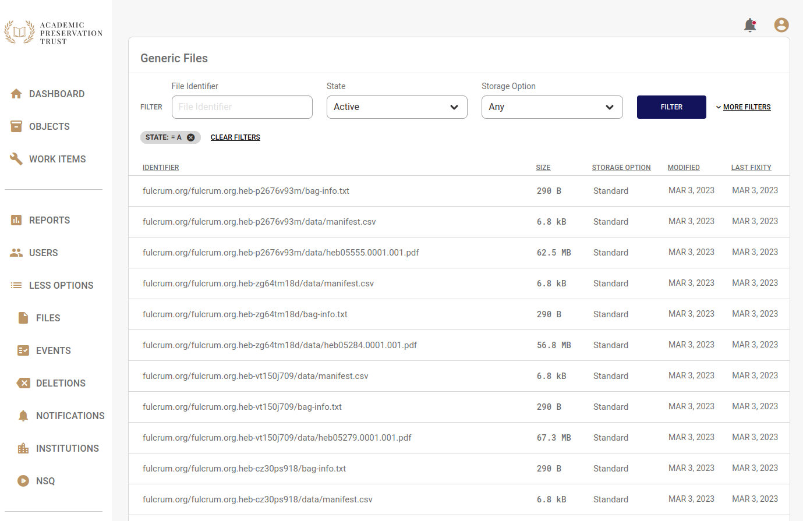
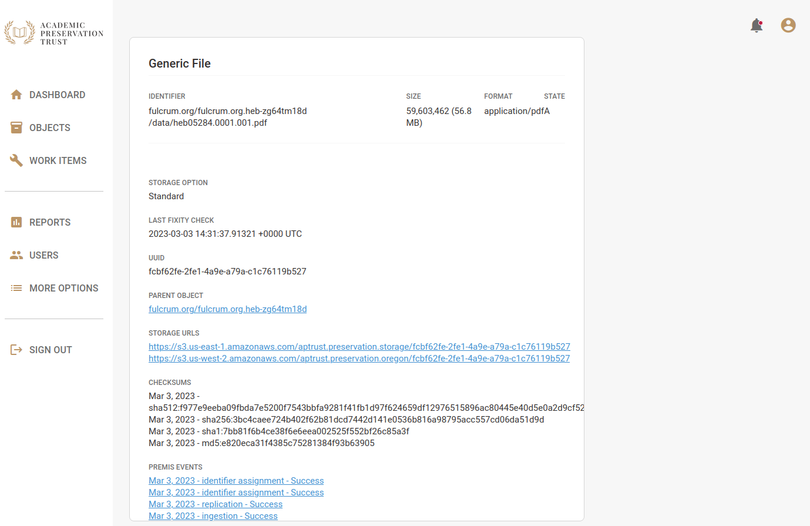

# Generic Files

Generic files are the individual files or bitstreams that make up intellectual objects. These may be photos, videos, text documents, XML metadata files exported from your internal repository, etc.

When you send a bag to your receiving bucket, APTrust creates an intellectual object from the bag (or updates an existing object, if the bag name matches the name of an existing object), and APTrust stores all of the bag's payload files and tag files. Any file outside the bag's data directory, except for manifests and tag manifests, is considered a tag file.

## Listing Files

You view a list of your institution's generic files by clicking on the __Files__ link under _More Options_ in the Registry's left nav bar.

Use the filters at the top of the page to narrow down the list. Standard filters include File Identifier, State, and Storage Option. Click the _More Filters_ link to filter by file size, creation date and modification date.

## File Details

Click on the identifier of any file to view its detail page. From the detail page, you'll see checksums and events related to the file. Scroll down to see the file _Restore_ button. Institutional admins will also see a _Delete_ button at the bottom of the file detail page.

