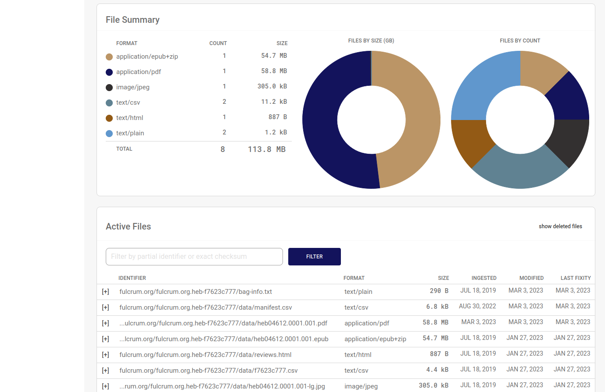

# Intellectual Objects

An intellectual object is a logical collection of files. Registry creates one intellectual object for each tarred bag file you upload to your receiving bucket. Collections spanning multiple bags can be logically linked using the Bag-Group-Identifier in the bag-info.txt file.

## Listing Objects

To view a list of your institution's intellectual objects, click the __Objects__ link in the left navigation bar.

To find objects by identifier, bag name, title, bag group identifier, or alternate identifier, click the _More Filters_ link. You'll find you can also filter by bag size, file count, and the dates on which objects were created or updated.

### Alternate Identifiers

Alternate identifiers come from the Internal-Sender-Identifier tag in the bag-info.txt file. This usually identifies an object using your internal identifier scheme. This field is optional and may be blank.

### Bag Group Identifiers

The optional bag group identifier comes from the Bag-Group-Identifier field in the bag-info.txt file. This is used to logically group a number of distinct intellectual objects. For example, some organizations prefer to break large collections into a series of smaller bags, each of which becomes a distinct intellectual object upon ingest.

A group of objects called `test.edu/smith_photos_1946`, `test.edu/smith_photos_1947`, and `test.edu/smith_photos_1948` may be logically grouped with the Bag-Group-Identifier `Smith Photos`. You can then search Registry for objects belonging to this group to find all files belonging to the `Smith Photos` collection.

## Viewing Object Details

Click any object title in the list of objects to view its details. The top of the object detail page displays essential metadata such as the object's title, description, and identifiers.

To the right is a list of recent PREMIS events and a button to restore the object. Institutional administrators will also see a button delete the object.

Scroll down the object detail page and you'll find file summary charts and a list of files that make up the object.

Click the plus sign next to any file in the list to see more information about that file. Info includes checksums, storage URLs and a button to restore the file. Institutional admins will also see a button to delete the file.

