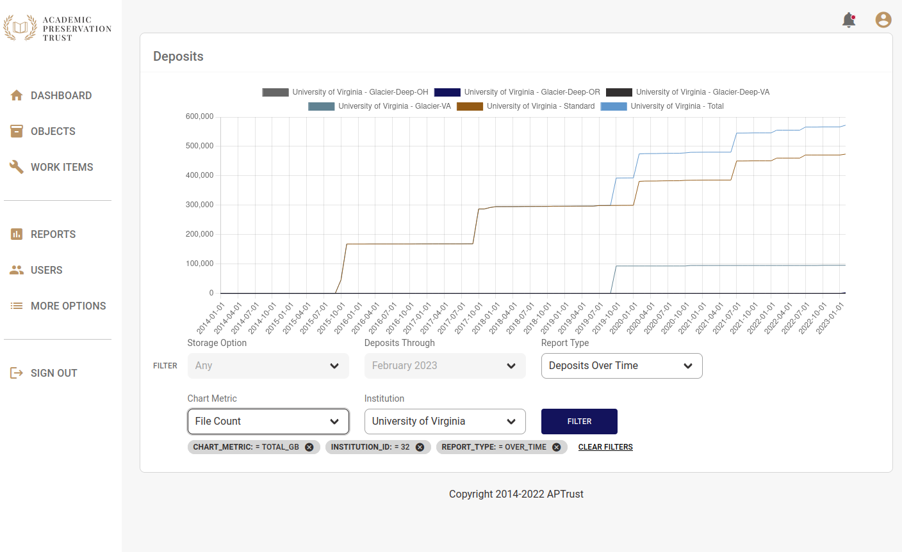

# Reports

The Registry includes two reports to show deposit statistics, Deposits by Institution and Deposits Over Time.

## Deposits by Institution

Deposits by Institution shows the deposits for an instition up until today, or up until the date selected in the __Deposits Through__ list. Most institutions can see only their own deposit numbers. Member Institutions will also be able to see deposit statistics for their Associate Members.

You can change the metric displayed in the graph by changing the __Chart Metric__ option to show deposits by Gigabyte or Terabyte, or to show the number of objects of files on deposit.

The raw numbers in the report appear in the table below the chart. Mouse over any bar on the chart to see a description of what the bar represents

## Deposits Over Time

Change the __Report Type__ selection to _Deposits Over Time_ and you'll see a line chart showing how the quantity of your institution's deposits have changed over time. As with _Deposits by Institution_, you can change which metrics appear on the chart.

This report does not currently show raw data below the chart because in many cases there are too many data points to display.

Note that you can show and hide lines on this chart by clicking the legend above the chart.

