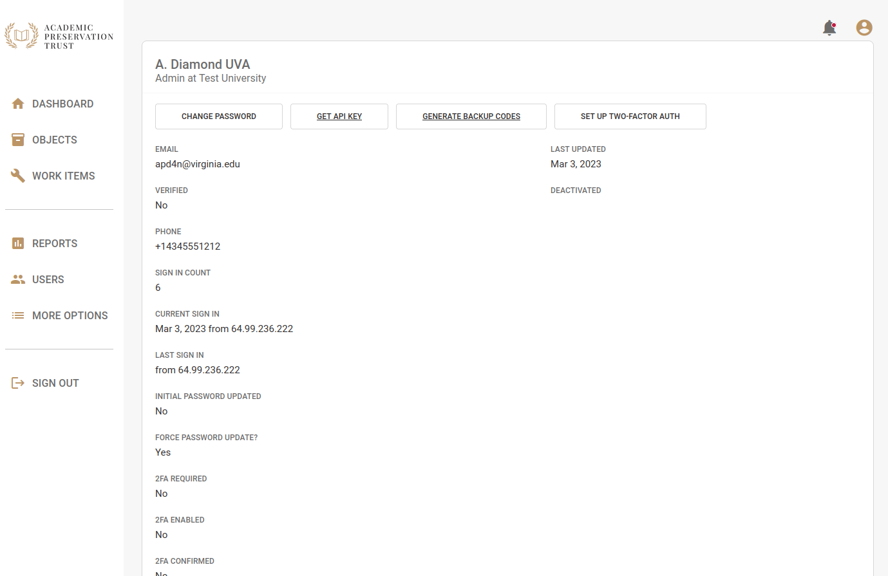
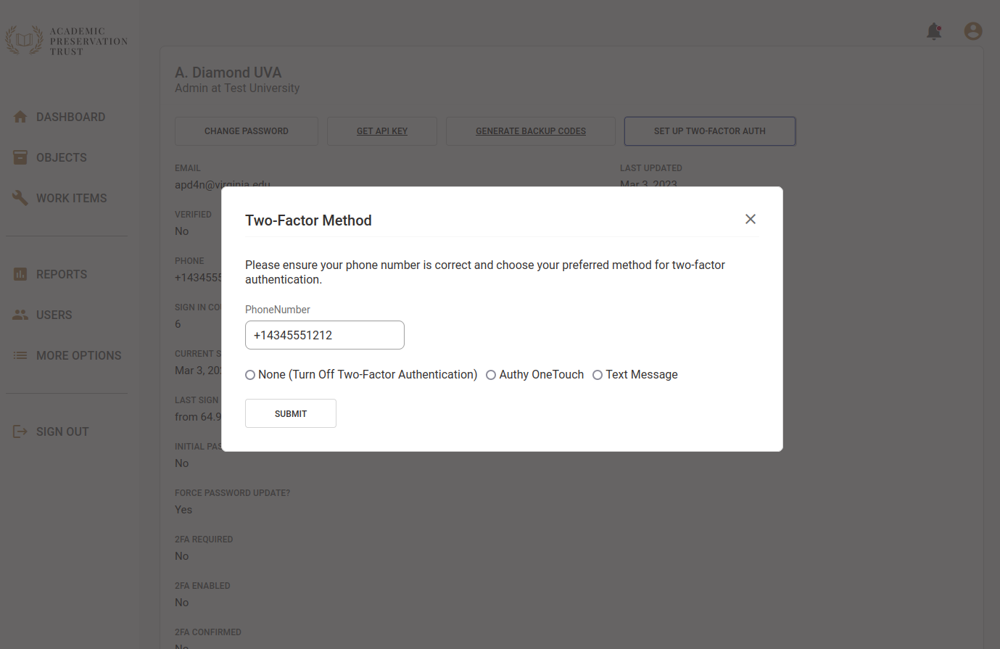
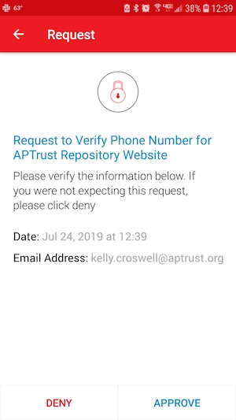
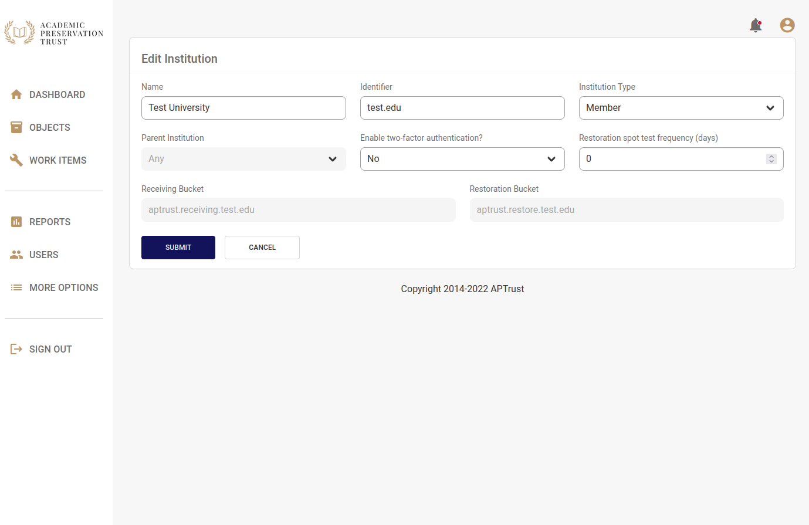

# Two-Factor Authentication

Registry supports two-factor authentication for users and institutions who want an extra layer of security. Two Factor Authentication is required for institutional administrators in both the production repository and the demo repository, since institutional admins have the ability to delete materials. It is not required for institutional users, however we recommend that all users enable it.

!!! tip
    Two-factor settings are separate on the production and demo repositories. Enabling or disabling this feature in the Registry production system has no effect on the demo system and vice-versa. You'll have to set your preferences separately on each system.

## Enabling Two-Factor Authentication

Institutional users can enable two-factor authentication for themselves. Institutional administrators can require it for all users at their institution, thereby forcing them to enable it. Institutional users who enable two-factor auth for themselves can choose to disable it later. When an administrator enables two-factor auth for their institution, users cannot opt out or disable the setting.

### Enabling Two-Factor for Yourself

To enable two-factor authentication for yourself, click the __My Account__ in the upper right corner of the screen.

Click the __Set Up Two-Factor Auth__ button. Then enter your mobile phone number and choose either Authenticator App, Authy or Text Message.

Using an Authenticator App will require you to enroll a compatible device, most commonly your phone, in 2FA by scanning a QR code (or entering a setup key) on your authenticator app of choice. Some common authenticator apps include Google Authenticator, Microsoft Authenticator, and the Duo app. Authy allows you to complete two-factor authentication via push notification, while Text sends a text (SMS) message to your phone with a one-time authentication token.

Click __Submit__ when you're done.

You should receive a text message or push notification within a minute or so. If you chose the authenticator app or text/SMS option, enter the code you received in the text message into the verification field in Registry. If you chose the authenticator app method, you will need to view your code in your app.

If you have Authy installed on your phone and you chose to verify via push notification, click the __Approve__ button when the Authy verification request appears.

#### Generating Backup Codes

If you're using two-factor authentication, you should generate a set of backup codes, in case you need to log in to the Registry when you don't have access to your phone.

To generate backup codes, click the __Generate Backup Codes__ button at the top of the My Account page. Copy your backup codes to a safe place on your computer. These codes are valid for one-time use.

### Enabling Two-Factor for Other Users or Your Entire Institution

Institutional administrators can require two-factor authentication for specific users at their institution, or for the institution as a whole.

To enable two-factor auth for a specific user:

1. Click __Users__ on the left nav bar.

2. Click the name of the user you want to edit.

3. Change __Require Two-Factor Auth__ to Yes.

4. Click __Submit__.

To require two-factor auth for your institution:

1. Click __More Options__ in the left navigation bar.

1. Click __Institution__.

1. Click __Edit__.

1. Change __Enable two-factor authentication?__ to Yes.

1. Click Submit.

### Grace Period for New Users

New users have a grace period during which they will be prompted to enabled two-factor authentication. On the production repository, this grace period is 30 days long. On the demo repository, this grace period is 90 days long. The grace period begins when the user's account is created. It applies to all users for whom two-factor auth is required (institutional administrators and institutional users for whom two-factor auth has been required at their institution).

### If You're Locked Out

If you can't log in and you don't have access to any valid backup codes, contact help@aptrust.org.
