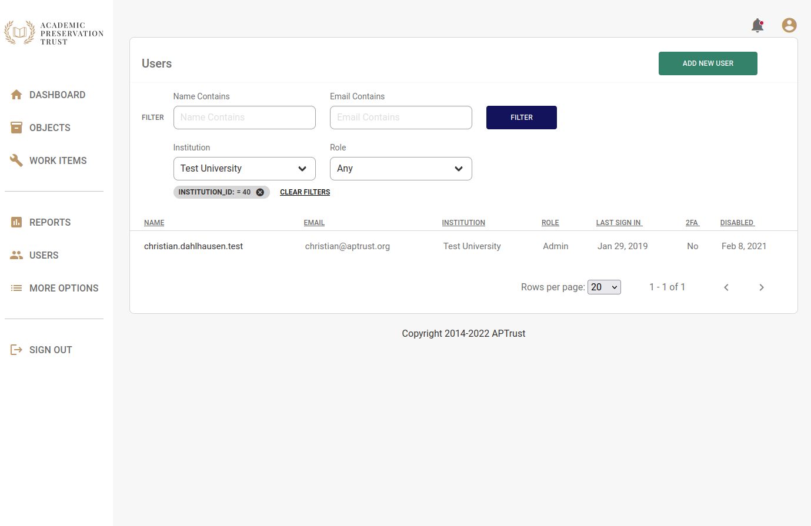
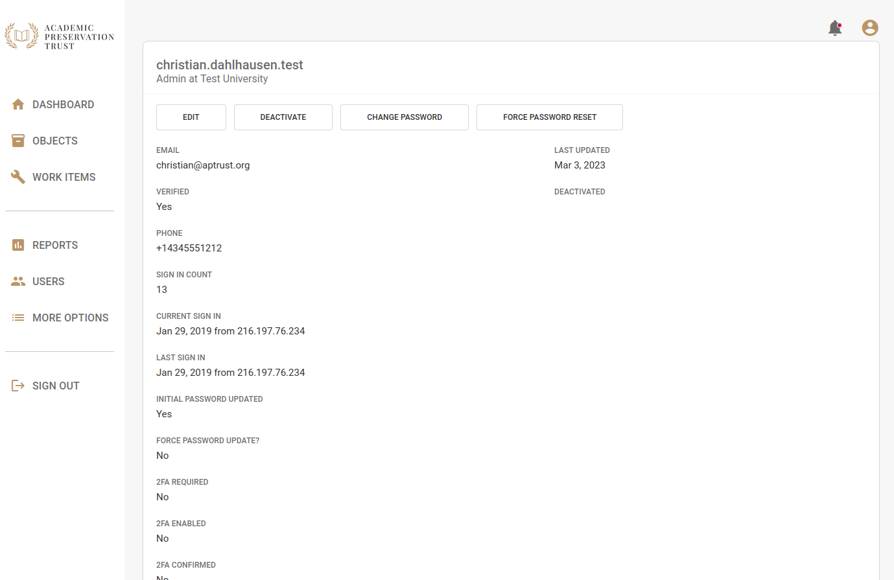
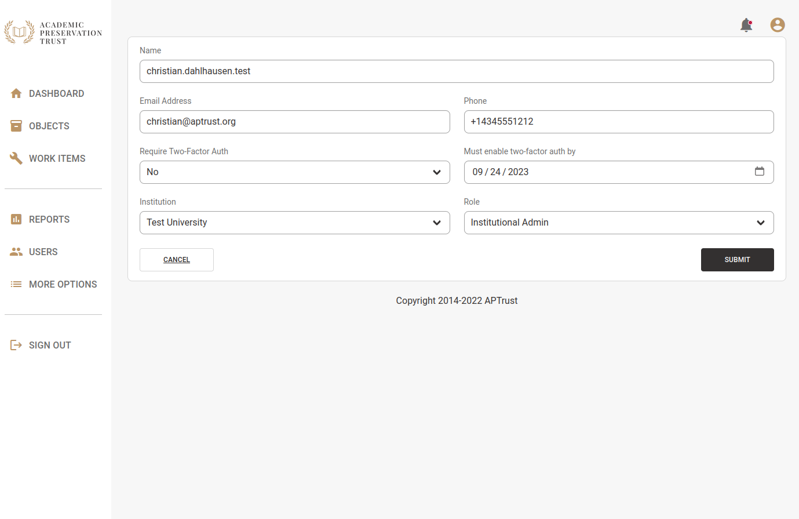
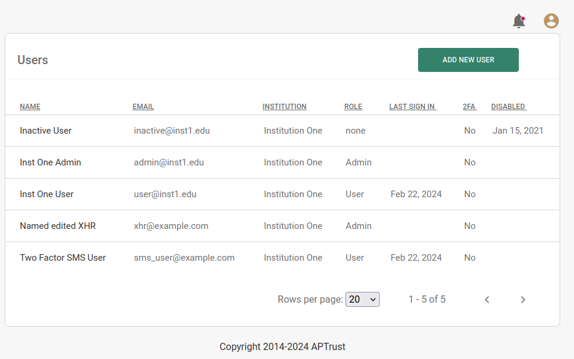
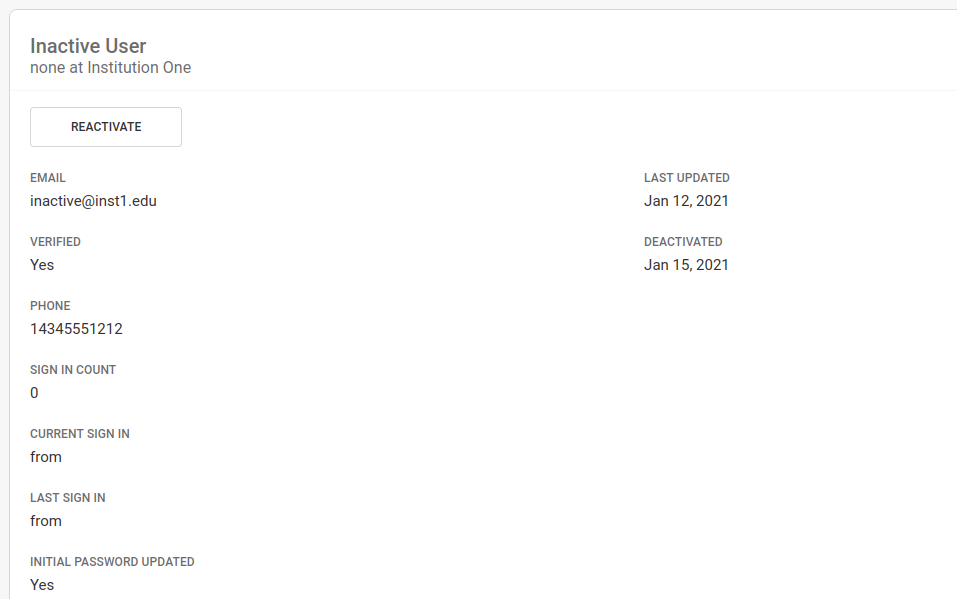

# User Management

## Listing Users

You can see a list of users at your institution by clicking the __Users__ link in the left nav bar.

## Viewing and Editing Users

Click any user in the Users list to view their details.

The buttons at the top of the screen do the following:

* __Edit__ - Edit user details. For details on what the settings mean, see _Adding New Users_ below.
* __Deactivate__ - Deactivates a user's account. Once deactivated, the user will not be able to log in. This action is reversible. You can re-activate any user at any time.
* __Change Password__ - This lets you specify a new password for a user.
* __Force Password Reset__ - This sends an email to the user with a special link that will let them choose their own new password.

## Adding New Users

Institutional administrators can add new users at their institition. To add a new user:

1. Click __Users__ in the left nav bar.

1. Click the green __Add New User__ button in the top right corner of the screen.

1. Enter the new user's name, email address and mobile phone number.

    1. This person will use the specified email address to log in.

    1. The phone number will be used for two-factor authentication, if the user has it enabled.

    1. If you want the user to use two-factor authentication, specify a date by which they must activate two-factor authentication. The user will need to log into the system before that date--without two-factor--to set up their multi-step authentication.

1. Select one of the following roles:

    1. Institutional Admin - This role has all the privilages of the institutional user, and can add, edit, and deactivate users at your organization. It can also access restricted objects and initiate and approve object and file deletions.

    1. Institutional User - This role can send materials to APTrust for ingest, and can view and restore files and objects that are not restricted.

## Reactivating Deactivated Users

1. Click the __Users__ link in the left nav bar.
1. Click on the name of the users you want to reactivate. Deactivated users have a non-empty Disabled date describing when their account was disabled. In the screenshot below, the first user in the list was deactivated on January 15, 2021.

    

1. On the user's detail page, click the __Reactivate__ button.

    
