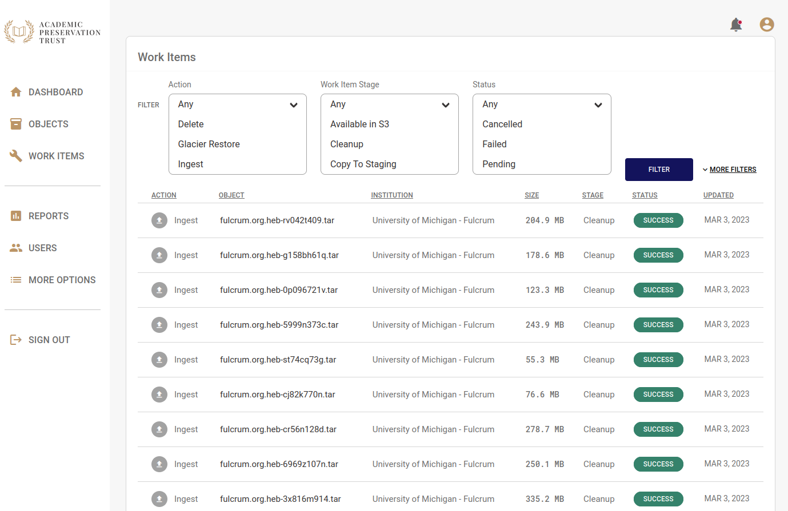

# Work Items

Work items are tasks that APTrust systems perform in response to depositor requests. The Work Items list shows the status of your institution's recent requests. You can view the list by clicking the __Work Items__ link in the left navigation bar.

You can filter the list to specific actions, statuses, and stages using the controls at the top of the list. To select multiple actions, statuses or stages, hold the Control key while clicking on items in the select list.

Click __More Filters__ to see a list of additional filters to help you narrow your search.

## Actions

Work Item actions include the following:

* __Delete__ - Deleting files or objects from preservation storage.

* __Glacier Restore__ - This is the first step in restoring objects and files from Glacier.

* __Ingest__ - Getting new or updated objects into the system.

* __Restore File__ - Restoring an individual file to a depositor's restoration bucket.

* __Restore Object__ - Restoring an intellectual object to a depositor's restoration bucket.

## Stages

* __Available in S3__ - A restored file or object is available in the depositor's S3 restoration bucket.

* __Cleanup__ - The task has completed and the system has cleaned up temporary files. This applies only to ingest and restoration actions. This stage is more meaningful to APTrust internal operations than to depositors.

* __Copy to Staging__ - Files are being copied to a staging bucket as part of the ingest process.

* __Format Identification__ - Files being ingested are undergoing format identification against a PRONOM database.

* __Fetch__ - The system is retrieving a bag from the receiving bucket for ingest, or is retrieving files from preservation storage for restortation.

* __Package__ - An intellectual object's files are being repackaged into a new bag for restoration.

* __Receive__ - APTrust has noticed a new bag in a receiving bucket, but has not yet begun to process it for ingest.

* __Record__ - The system has finished copying a bag's files to preservation storage and is now recording metadata in Registry.

* __Reingest Check__ - Files being ingested are checked against known files in the Registry to see if they've been ingested before. The system will re-ingest files only if they've changed since the last ingest.

* __Requested__ - A depositor has requested a restoration or deletion, but the system has not yet begun to process it.

* __Resolve__ - A task has completed. See Statuses below for the outcome.

* __Restoring__ - Files are in process of being restored to a depositor's restoration bucket.

* __Storage Validation__ - The ingest process is verifying that files copied into preservation storage were copied successfully.

* __Store__ - Files are being copied to long-term preservation. This applies only to ingest.

* __Unpack__ - Obsolete. This stage remains because it was used in some early ingests between 2015 and 2016.

* __Validate__ - The system is validating a bag before ingest, or it's validating a bag it has just assembled for restoration.

## Statuses

* __Cancelled__ - The task was cancelled by an APTrust administrator. You find an explanation of the cancellation by clicking on the item and reading the Note/Error field.

* __Failed__ - The task failed. Virtually all failures result from one of the following causes:

    * A depositor submitted an invalid bag for ingest. This is a permanent error and the system will not retry the task until the depositor submits a new version of the bag.

    * The system has run into a temporary problem such as lack of disk space or poor network connection. The system will automatically retry the task. If the task fails repeatedly, an APTrust admin will try to solve the underlying problem and then tell the system to retry the task again.

* __Pending__ - The system is waiting for available resources to start the next stage of the task. See Stages above.

* __Started__ - The system has started the current Stage of the task and is still working on it. The Fetch, Validate, Store, Record, and Package stages can take several hours for very large bags.

* __Success__ - The task completed successfully.

* __Suspended__ - The task was suspended due to a potential conflict. These items are flagged for administrator review, and an APTrust administrator will determine whether to resume or cancel the item.
